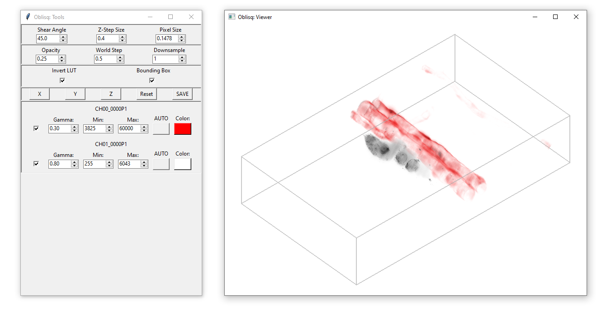

# Oblisq: 3D Rendering Tool for Oblique Microscopy Data



## Why not *Napari*, *Fiji*, etc?

[Oblique Plane Microscopy](https://elifesciences.org/articles/57681) acquires datasets which must be computationally deskewed and rotated. Powerful tools exist to do this for [Petabyte-scale datasets](https://github.com/abcucberkeley/PetaKit5D), but offline processing hinders instantaneous feedback. **Oblisq** is built from the ground up using OpenGL and performs live deskew-rotation in the fragment shader with physical parameters set by the user. The rendering backend is also designed to be integrated with [Navigate](https://github.com/TheDeanLab/navigate/) microscope control software (or any Python-based microscopy platform) to instantly render 3D volumes collected live during microscopy experiments, providing critical tactile feedback when acquire oblique volumetric datasets.

## Requirements
- GPU + NVIDIA drivers supporting OpenGL 4.3 Core Profile
- Windows or Linux
- Anaconda with Python 3.11+

## Installation

### For development (conda)

```console
cd /directory/to/cloned/repo/Oblisq
conda env create -n oblisq
```

No need for manual pip install, `environment.yml` will handle python version and dependency installs during conda create.

### From PyPI

Oblisq ships as two layers:

- `pip install oblisq` installs only the OpenGL rendering core
  (`oblisq.gl_backend`) — numpy, PyOpenGL, glfw, and PyGLM. This is what a
  host application (e.g. [Navigate](https://github.com/TheDeanLab/navigate/))
  should depend on if it just wants to embed live 3D rendering.
- `pip install "oblisq[app]"` additionally installs the standalone drag-and-drop
  viewer's dependencies (tifffile, dask, zarr, etc.) and unlocks the `oblisq`
  console script described below.

## Startup

```console
conda activate oblisq
oblisq
```

## Usage

**Drag and Drop**: *.Tif* or *.Tiff* files into the GUI to load. Similar sized stacks will be grouped as channels in sorted order. <br>
**TAB**: Switch between *Perspective* and *Orthogonal* camera projections. <br>
**SHIFT**: Snap camera angular increments to 15-degrees. <br>
**SAVE**: Pulls exact screenshot of the viewport and saves it to the working directory. <br>
**X, Y, Z**: Snap the volume view to set axes.
